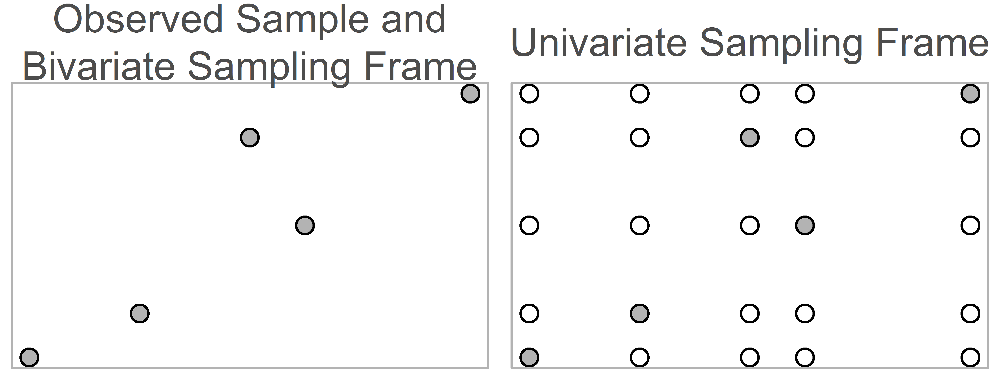

This report covers the analyses used in the APA Simulation Chapter the covers Bootstrap and Simulation Methods (William H Beasley, Patrick O'Keefe, & Joseph Rodgers).

<!--  Set the working directory to the repository's base directory; this assumes the report is nested inside of two directories.-->

```
## Warning: package 'knitr' was built under R version 4.1.1
```

<!-- Set the report-wide options, and point to the external code file. -->


<!-- Load 'sourced' R files.  Suppress the output when loading sources. -->


<!-- Load packages, or at least verify they're available on the local machine.  Suppress the output when loading packages. -->


<!-- Load any global functions and variables declared in the R file.  Suppress the output. -->


<!-- Declare any global functions specific to a Rmd output.  Suppress the output. -->


<!-- Load the datasets.   -->


<!-- Tweak the datasets.   -->


Notes
---------------------------------------------------------------------------


Example 1: Waiting Times Basic 
===========================================================================


```
[1] 23.97086
```

```
[1] 13.55982
```

```
 2.5% 97.5% 
  4.0  58.2 
```

<!-- -->

```
[1] 0.033
```

Example 2: Sampling Frames 
===========================================================================

<!-- -->

Example 3: Rejection Sampling
===========================================================================

<!-- -->

Example 4: Independent Metropolis-Hastings
===========================================================================

<!-- -->

Session Information {#session-info}
===========================================================================

For the sake of documentation and reproducibility, the current report was rendered in the following environment.  Click the line below to expand.

<details>
  <summary>Environment <span class="glyphicon glyphicon-plus-sign"></span></summary>

```
- Session info ---------------------------------------------------------------
 setting  value                                      
 version  R version 4.1.0 Patched (2021-05-29 r80415)
 os       Windows >= 8 x64                           
 system   x86_64, mingw32                            
 ui       RTerm                                      
 language (EN)                                       
 collate  English_United States.1252                 
 ctype    English_United States.1252                 
 tz       America/Chicago                            
 date     2021-09-24                                 

- Packages -------------------------------------------------------------------
 package     * version date       lib source        
 assertthat    0.2.1   2019-03-21 [1] CRAN (R 4.1.0)
 bslib         0.3.0   2021-09-02 [1] CRAN (R 4.1.1)
 cachem        1.0.6   2021-08-19 [1] CRAN (R 4.1.1)
 callr         3.7.0   2021-04-20 [1] CRAN (R 4.1.0)
 cli           3.0.1   2021-07-17 [1] CRAN (R 4.1.0)
 crayon        1.4.1   2021-02-08 [1] CRAN (R 4.1.0)
 DBI           1.1.1   2021-01-15 [1] CRAN (R 4.1.0)
 desc          1.3.0   2021-03-05 [1] CRAN (R 4.1.0)
 devtools      2.4.2   2021-06-07 [1] CRAN (R 4.1.0)
 digest        0.6.27  2020-10-24 [1] CRAN (R 4.1.0)
 dplyr         1.0.7   2021-06-18 [1] CRAN (R 4.1.0)
 ellipsis      0.3.2   2021-04-29 [1] CRAN (R 4.1.0)
 evaluate      0.14    2019-05-28 [1] CRAN (R 4.1.0)
 fansi         0.5.0   2021-05-25 [1] CRAN (R 4.1.0)
 fastmap       1.1.0   2021-01-25 [1] CRAN (R 4.1.0)
 fs            1.5.0   2020-07-31 [1] CRAN (R 4.1.0)
 generics      0.1.0   2020-10-31 [1] CRAN (R 4.1.0)
 glue          1.4.2   2020-08-27 [1] CRAN (R 4.1.0)
 highr         0.9     2021-04-16 [1] CRAN (R 4.1.0)
 htmltools     0.5.2   2021-08-25 [1] CRAN (R 4.1.1)
 import        1.2.0   2020-09-24 [1] CRAN (R 4.1.0)
 jquerylib     0.1.4   2021-04-26 [1] CRAN (R 4.1.0)
 jsonlite      1.7.2   2020-12-09 [1] CRAN (R 4.1.0)
 knitr       * 1.34    2021-09-09 [1] CRAN (R 4.1.1)
 lifecycle     1.0.0   2021-02-15 [1] CRAN (R 4.1.0)
 magrittr      2.0.1   2020-11-17 [1] CRAN (R 4.1.0)
 memoise       2.0.0   2021-01-26 [1] CRAN (R 4.1.0)
 pillar        1.6.2   2021-07-29 [1] CRAN (R 4.1.1)
 pkgbuild      1.2.0   2020-12-15 [1] CRAN (R 4.1.0)
 pkgconfig     2.0.3   2019-09-22 [1] CRAN (R 4.1.0)
 pkgload       1.2.2   2021-09-11 [1] CRAN (R 4.1.0)
 prettyunits   1.1.1   2020-01-24 [1] CRAN (R 4.1.0)
 processx      3.5.2   2021-04-30 [1] CRAN (R 4.1.0)
 ps            1.6.0   2021-02-28 [1] CRAN (R 4.1.0)
 purrr         0.3.4   2020-04-17 [1] CRAN (R 4.1.0)
 R6            2.5.1   2021-08-19 [1] CRAN (R 4.1.1)
 remotes       2.4.0   2021-06-02 [1] CRAN (R 4.1.0)
 rlang         0.4.11  2021-04-30 [1] CRAN (R 4.1.0)
 rmarkdown     2.10    2021-08-06 [1] CRAN (R 4.1.1)
 rprojroot     2.0.2   2020-11-15 [1] CRAN (R 4.1.0)
 rstudioapi    0.13    2020-11-12 [1] CRAN (R 4.1.0)
 sass          0.4.0   2021-05-12 [1] CRAN (R 4.1.0)
 sessioninfo   1.1.1   2018-11-05 [1] CRAN (R 4.1.0)
 stringi       1.7.4   2021-08-25 [1] CRAN (R 4.1.1)
 stringr       1.4.0   2019-02-10 [1] CRAN (R 4.1.0)
 testthat      3.0.4   2021-07-01 [1] CRAN (R 4.1.0)
 tibble        3.1.4   2021-08-25 [1] CRAN (R 4.1.1)
 tidyselect    1.1.1   2021-04-30 [1] CRAN (R 4.1.0)
 usethis       2.0.1   2021-02-10 [1] CRAN (R 4.1.0)
 utf8          1.2.2   2021-07-24 [1] CRAN (R 4.1.0)
 vctrs         0.3.8   2021-04-29 [1] CRAN (R 4.1.0)
 withr         2.4.2   2021-04-18 [1] CRAN (R 4.1.0)
 xfun          0.25    2021-08-06 [1] CRAN (R 4.1.1)
 yaml          2.2.1   2020-02-01 [1] CRAN (R 4.1.0)

[1] D:/Projects/RLibraries
[2] D:/Users/Will/Documents/R/win-library/4.1
[3] C:/Program Files/R/R-4.1.0patched/library
```
</details>


Report rendered by Will at 2021-09-24, 16:57 -0500 in 17 seconds.
