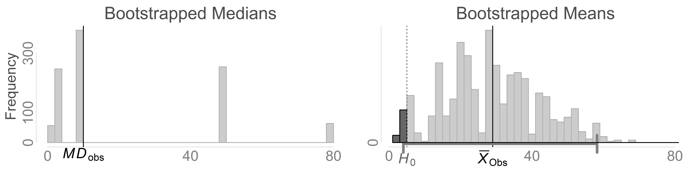
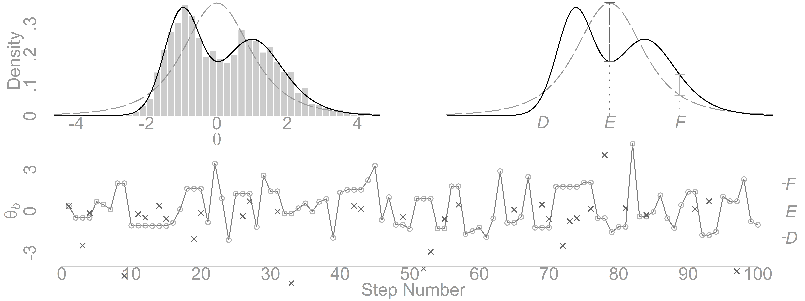

This report covers the analyses used in the APA Simulation Chapter the covers Bootstrap and Simulation Methods (William H Beasley, Patrick O'Keefe, & Joseph Rodgers).

<!--  Set the working directory to the repository's base directory; this assumes the report is nested inside of two directories.-->


<!-- Set the report-wide options, and point to the external code file. -->


<!-- Load 'sourced' R files.  Suppress the output when loading sources. -->


<!-- Load packages, or at least verify they're available on the local machine.  Suppress the output when loading packages. -->


<!-- Load any global functions and variables declared in the R file.  Suppress the output. -->


<!-- Declare any global functions specific to a Rmd output.  Suppress the output. -->


<!-- Load the datasets.   -->


<!-- Tweak the datasets.   -->


Notes
---------------------------------------------------------------------------


Example 1: Waiting Times Basic 
===========================================================================


```
[1] 23.97086
```

```
[1] 13.55982
```

```
 2.5% 97.5% 
  4.0  58.2 
```

<!-- -->

```
[1] 0.033
```

Example 2: Sampling Frames 
===========================================================================

<!-- -->

Example 3: Rejection Sampling
===========================================================================

<!-- -->

Example 4: Independent Metropolis-Hastings
===========================================================================

<!-- -->

Session Information {#session-info}
===========================================================================

For the sake of documentation and reproducibility, the current report was rendered in the following environment.  Click the line below to expand.

<details>
  <summary>Environment <span class="glyphicon glyphicon-plus-sign"></span></summary>

```
- Session info ---------------------------------------------------------------
 setting  value                                      
 version  R version 4.0.4 Patched (2021-02-17 r80031)
 os       Windows >= 8 x64                           
 system   x86_64, mingw32                            
 ui       RTerm                                      
 language (EN)                                       
 collate  English_United States.1252                 
 ctype    English_United States.1252                 
 tz       America/Chicago                            
 date     2021-04-07                                 

- Packages -------------------------------------------------------------------
 package     * version date       lib source        
 assertthat    0.2.1   2019-03-21 [1] CRAN (R 4.0.0)
 bslib         0.2.4   2021-01-25 [1] CRAN (R 4.0.3)
 cachem        1.0.4   2021-02-13 [1] CRAN (R 4.0.4)
 callr         3.6.0   2021-03-28 [1] CRAN (R 4.0.4)
 cli           2.3.1   2021-02-23 [1] CRAN (R 4.0.4)
 crayon        1.4.1   2021-02-08 [1] CRAN (R 4.0.3)
 DBI           1.1.1   2021-01-15 [1] CRAN (R 4.0.3)
 debugme       1.1.0   2017-10-22 [1] CRAN (R 4.0.0)
 desc          1.3.0   2021-03-05 [1] CRAN (R 4.0.4)
 devtools      2.3.2   2020-09-18 [1] CRAN (R 4.0.2)
 digest        0.6.27  2020-10-24 [1] CRAN (R 4.0.3)
 dplyr         1.0.5   2021-03-05 [1] CRAN (R 4.0.4)
 ellipsis      0.3.1   2020-05-15 [1] CRAN (R 4.0.0)
 evaluate      0.14    2019-05-28 [1] CRAN (R 4.0.0)
 fansi         0.4.2   2021-01-15 [1] CRAN (R 4.0.3)
 fastmap       1.1.0   2021-01-25 [1] CRAN (R 4.0.3)
 fs            1.5.0   2020-07-31 [1] CRAN (R 4.0.2)
 generics      0.1.0   2020-10-31 [1] CRAN (R 4.0.2)
 glue          1.4.2   2020-08-27 [1] CRAN (R 4.0.2)
 highr         0.8     2019-03-20 [1] CRAN (R 4.0.0)
 htmltools     0.5.1.1 2021-01-22 [1] CRAN (R 4.0.3)
 import        1.2.0   2020-09-24 [1] CRAN (R 4.0.2)
 jquerylib     0.1.3   2020-12-17 [1] CRAN (R 4.0.3)
 jsonlite      1.7.2   2020-12-09 [1] CRAN (R 4.0.3)
 knitr       * 1.31    2021-01-27 [1] CRAN (R 4.0.3)
 lifecycle     1.0.0   2021-02-15 [1] CRAN (R 4.0.4)
 magrittr      2.0.1   2020-11-17 [1] CRAN (R 4.0.3)
 memoise       2.0.0   2021-01-26 [1] CRAN (R 4.0.3)
 pillar        1.5.1   2021-03-05 [1] CRAN (R 4.0.4)
 pkgbuild      1.2.0   2020-12-15 [1] CRAN (R 4.0.3)
 pkgconfig     2.0.3   2019-09-22 [1] CRAN (R 4.0.0)
 pkgload       1.2.0   2021-02-23 [1] CRAN (R 4.0.4)
 prettyunits   1.1.1   2020-01-24 [1] CRAN (R 4.0.0)
 processx      3.5.0   2021-03-23 [1] CRAN (R 4.0.4)
 ps            1.6.0   2021-02-28 [1] CRAN (R 4.0.4)
 purrr         0.3.4   2020-04-17 [1] CRAN (R 4.0.0)
 R6            2.5.0   2020-10-28 [1] CRAN (R 4.0.2)
 remotes       2.2.0   2020-07-21 [1] CRAN (R 4.0.2)
 rlang         0.4.10  2020-12-30 [1] CRAN (R 4.0.3)
 rmarkdown     2.7     2021-02-19 [1] CRAN (R 4.0.4)
 rprojroot     2.0.2   2020-11-15 [1] CRAN (R 4.0.2)
 sass          0.3.1   2021-01-24 [1] CRAN (R 4.0.3)
 sessioninfo   1.1.1   2018-11-05 [1] CRAN (R 4.0.0)
 stringi       1.5.3   2020-09-09 [1] CRAN (R 4.0.2)
 stringr       1.4.0   2019-02-10 [1] CRAN (R 4.0.0)
 testthat      3.0.2   2021-02-14 [1] CRAN (R 4.0.4)
 tibble        3.1.0   2021-02-25 [1] CRAN (R 4.0.4)
 tidyselect    1.1.0   2020-05-11 [1] CRAN (R 4.0.0)
 usethis       2.0.1   2021-02-10 [1] CRAN (R 4.0.3)
 utf8          1.2.1   2021-03-12 [1] CRAN (R 4.0.4)
 vctrs         0.3.7   2021-03-29 [1] CRAN (R 4.0.4)
 withr         2.4.1   2021-01-26 [1] CRAN (R 4.0.3)
 xfun          0.22    2021-03-11 [1] CRAN (R 4.0.4)
 yaml          2.2.1   2020-02-01 [1] CRAN (R 4.0.0)

[1] D:/Projects/RLibraries
[2] D:/Users/Will/Documents/R/win-library/4.0
[3] C:/Program Files/R/R-4.0.4patched/library
```
</details>


Report rendered by Will at 2021-04-07, 12:58 -0500 in 2 seconds.
